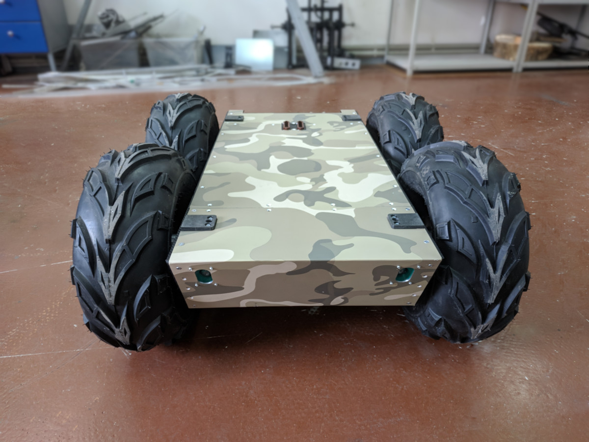

# Вомбат: базовая платформа

Базовая платформа обеспечивает передвижение Вомбата и его электропитание. Внутри нее располагаются моторы и [их контроллеры](#контроллеры-двигателей), а также тяговые свинцово-кислотные аккумуляторы, обеспечивающие электропитание ходовой части и подсоединенного [отсека для оборудования](user_space.md).

<table style="width:100%;">
 <tr>
   <th colspan="2" style="text-align: center">Технические характеристики</th>
 </tr>
 <tr>
   <td>Габаритные размеры (Д х Ш х В)</td>
   <td>900 х 680 х 470 мм </td>
 </tr>
 <tr>
   <td>Масса</td>
   <td>70 кг</td>
 </tr>
 <tr>
   <td>Максимальный вес нагрузки</td>
   <td>70 кг для ровной местности   50 кг для любой местности</td>
 </tr>
 <tr>
   <td>Максимальная скорость</td>
   <td>1 м/с</td>
 </tr>
 <tr>
   <td>Номинальное время работы</td>
   <td>3 ч без нагрузки</td>
 </tr>
 <tr>
   <td>Время полного заряда</td>
   <td>5 ч</td>
 </tr>
 <tr>
   <td>Диаметр колес</td>
   <td>410 мм</td>
 </tr>
</table>

  

В основе платформы лежит сварная рама, обеспечивающая грузоподъемность до 50 кг. Спереди и сзади Вомбат оснащен бамперами, защищающими элементы конструкции и установленное оборудование от механических повреждений в случае возможных столкновений с теми или иными препятствиями. Простой механизм смены колёс позволяет подстраиваться под сезонность и местность эксплуатации.

В роботе установлены двигатели с планетарными редукторами, способные поддерживать высокий момент даже при низкой угловой скорости, а раздельное управление правой и левой сторонами платформы позволяет Вомбату поворачиваться на месте. Для управления движением используются [силовые контроллеры двигателей](#контроллеры-двигателей) и энкодеры, показания которых позволяют оценивать скорости движения колёсных осей.

Основное напряжение питания - 24 В; в отсек для оборудования подаются также напряжения 5 В, 12 В, 20 В, 48 В. Каждая линия электропитания снабжена предохранителем и выключателем, что позволяет осуществлять раздельное включение и выключение компонентов робота. Зарядка аккумуляторов производится от стандартной сети 220 В при помощи [зарядного устройства](../basics/charging.md#зарядное-устройство), поставляющегося вместе с роботом.

Для коммуникации с отсеком для оборудования используются встроенные в верхнюю часть платформы разъемы, а для надежного крепления модулей друг к другу - боковые петли.

### Элементы корпуса

В передней части корпуса расположены фары для дополнительного освещения в условиях плохой видимости. В задней части корпуса расположены кнопка [общего включения робота](../basics/power_on_off.md#общее-включение-робота), индивидуальные автоматические выключатели, вольтамперметр и разъем для [подзарядки робота](../basics/charging.md).

Автоматические выключатели (предохранители) подключены к следующими линиями электропитания:
* общее питание 24 В &mdash; подключение к аккумуляторам;
* питание контроллеров управления моторами;
* линии 12 В, 20 В, подаваемые в отсек для оборудования;
* линия 48 В, подаваемая в отсек для оборудования.

Вольтамперметр предназначен для отображения текущих значений напряжения и тока на аккумуляторах. При помощи него можно своевременно определить, что Вомбат полностью зарядился либо же, наоборот, нуждается в подзарядке.

Разъем для подзарядки снабжен защитным колпачком, защищающим его от внешней среды, и направляющими, обеспечивающими защиту от некорректного подключения зарядного устройства.

### Контроллеры двигателей

Для индивидуального управления двигателями используются силовые контроллеры, рассчитанные на подключение двигателей суммарной мощностью до 720 Вт. Между собой контроллеры соединены при помощи интерфейса RS-485, а к бортовому компьютеру подключаются посредством сети Ethernet. Способ объединения контроллеров в единую систему таков, что взаимодействует пользователь только с одним из контроллеров, передавая ему управляющие команды и получая от него таких данные как температура двигателей, напряжение в бортовой сети и т.д.

Для взаимодействия с контроллерами при помощи программной среды ROS существует драйвер [wombat_hardware_driver](https://github.com/kb-avrora/wombat_hardware_interface).
