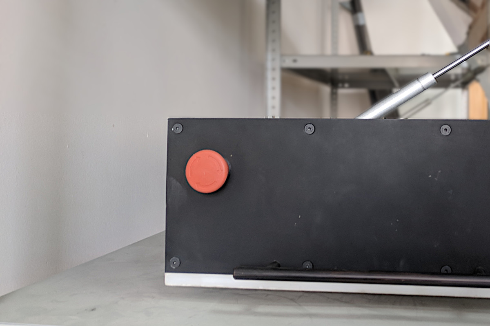

# Меры безопасности при работе с роботом Вомбат

Робот имеет значительную массу, выступающие части и может представлять опасность для людей и имущества. Он предназначен для использования людьми старше 16 лет. При автономном движении рядом с роботом всегда должен находиться оператор, способный оперативно остановить робота и перехватить управление им при помощи [пульта дистанционного управления](../workmodes/remote_control.md#пульт-дистанционного-управления). Робот также оснащён [стоп-кнопками](#стоп-кнопки), расположенными в передней и задней частях платформы и предназначенными для мгновенной остановки робота.

**Запрещается** использование робота без соответствующего наблюдения и возможности оперативного прекращения движения.

**Запрещается** использование робота на дорогах общего пользования, в общественных местах и местах массового скопления людей.

**Запрещается** катание на роботе и перевозка людей и животных.

**Запрещается** эксплуатация робота рядом с источниками открытого огня, в условиях повышенной влажности и в агрессивной внешней среде.

**Запрещается** опрокидывание робота, а также превышение углов наклона, указанных в спецификации.

**Запрещается** превышение грузоподъёмности робота.

## Экстренная остановка робота

Во избежание и при возникновении опасных ситуаций (поведение робота не соответствует ожиданиям, является непредсказуемым, может нанести вред людям или имуществу), необходимо прибегнуть к механизму экстренной остановки робота.

Существуют два способа остановки робота:
1. **Изменение режима работы робота** с автономного режима на ручное управление.  
   При [изменении режима работы](../workmodes/remote_control.md#пульт-дистанционного-управления) робота на "Ручное управление" контроллер двигателей перестают выполнять команды, получаемые по сети Ethernet, и выполняют команды, полученные от пульта ДУ. Таким образом возможно приостановить работу робота, "помочь" ему проехать сложный участок пути, а затем продолжить работу робота в автономном режиме. Данный способ остановки не может считаться аварийным, т.к. не происходит отключения каких-либо систем робота, а робот способен передвигаться в соответствии с командами, поступающими с пульта ДУ.

2. **Использование кнопок аварийной остановки робота** (стоп-кнопок).  
   Использование стоп-кнопок предполагается в экстренных ситуациях, когда поведение робота непредсказуемо и способно нанести вред. В результате нажатия на стоп-кнопку происходит обесточивание робота, после которого требуется перезапуск всех систем робота. Данный способ представляет собой средство аварийной остановки робота.  

### Стоп-кнопки

Вомбат оборудован контактными стоп-кнопками, расположенными на передней и задней частях платформы и используемыми для экстренной остановки робота. Для остановки робота необходимо нажать на стоп-кнопку с достаточным усилием. Чтобы вернуть стоп-кнопку в нормальное положение, необходимо повернуть ее в соответствии с обозначениями на корпусе.

## Меры безопасности при работе с аккумуляторами

Робот оснащён свинцово-кислотными необслуживаемыми аккумуляторами. В комплекте с роботом поставляется зарядное устройство, предназначенное для зарядки аккумуляторов. Подробнее процесс зарядки описан в [соответствующем разделе](charging.md).  

Во время зарядки аккумуляторов робот **должен быть обесточен**. Не должна проводиться какая-либо работа с роботом.

**Запрещается** зарядка аккумуляторов без присмотра.

**Запрещается** зарядка аккумуляторов робота на улице, в помещениях с повышенной влажностью, а также не предназначенных для пользования электрооборудованием.

**Запрещается** использовать зарядное устройство, отличное от поставляемого с роботом.
