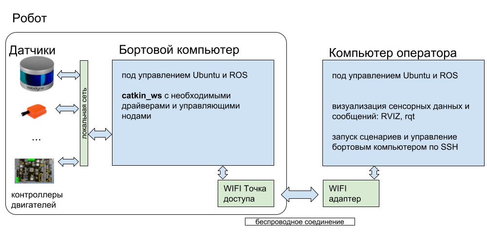

# Начало работы

* [Общие сведения](#общие-сведения)
* [Установка Ubuntu](#установка-ubuntu)
* [Установка ROS](#установка-ros)
* [Рабочее пространство пользователя (воркспейс)](#рабочее-пространство-пользователя)

## Общие сведения

Бортовой компьютер робота Вомбат поставлятеся с предустановленными операционной системой Ubuntu и ROS, а также с настроенным рабочим пространством пользователя (catkin_workspace) и предустановленным набором пакетов. Для возможности визуализации сенсорных данных и удобного управления бортовым компьютером вам может понадобиться второй комьютер(оператора), оснащённый WIFI модулем, на котором также должны быть установлены Ubuntu и ROS.



Поддерживаемые версии:

- Ubuntu 18.04 LTS
- ROS Melodic

## Установка Ubuntu

Установка операционной системы Ubuntu состоит из типовых шагов. Подробнее этот процесс описан [на сайте официальной документации](https://tutorials.ubuntu.com/tutorial/tutorial-install-ubuntu-desktop)

## Установка ROS

Основной операционной системой для работы ROS является Ubuntu; ROS также может работать с Debian, Windows, OS X и Android, однако работа в этих окружениях поддерживается не полностью и в целом менее стабильна, поэтому не рекомендуется начинающим. Новый релиз ROS выходит каждый год и поддерживает как актуальный релиз Ubuntu с долгосрочной поддержкой (LTS), так и один или два регулярных релиза Ubuntu. Установка произвольного релиза ROS в рамках произвольного релиза Ubuntu возможна, однако сопряжена с установкой и сборкой системы из исходного кода и не рекомендуется начинающим пользователям. Таким образом, выбор релиза ROS определяется используемой ОС, либо же выбор ОС определяется желаемым релизом ROS.

Актуальным на данный момент релизом ROS является [Melodic Morenia](http://wiki.ros.org/melodic), предполагающий использование с Ubuntu 18.04 LTS. Рассмотрим процесс установки этого релиза, описанный также в [официальной документации](http://wiki.ros.org/melodic/Installation/Ubuntu); установка других релизов ROS отличается только именем релиза в названиях устанавливаемых пакетов.

#### 1. Настройка репозиториев Ubuntu

Ubuntu должна быть сконфигурирована таким образом, чтобы позволять установку пакетов из репозиториев, помеченных как "restricted," "universe," и "multiverse".

#### 2. Добавление репозиториев ROS

Репозитории ROS, из которых Ubuntu будет получать необходимые пакеты, не сконфигурированы по умолчанию при установке системы, поэтому необходимо указать источник для скачивания этих пакетов:

```bash
sudo sh -c 'echo "deb http://packages.ros.org/ros/ubuntu $(lsb_release -sc) main" > /etc/apt/sources.list.d/ros-latest.list'
```
#### 3. Настройка GPG-ключей
Для подтверждения подлинности скачанных файлов в Ubuntu используется шифрование [GPG](https://ru.wikipedia.org/wiki/GnuPG), поэтому необходимо указать системе публичный ключ для проверки устанавливаемых пакетов.

```bash
sudo apt-key adv --keyserver hkp://ha.pool.sks-keyservers.net:80 --recv-key 421C365BD9FF1F717815A3895523BAEEB01FA116
```

#### 4. Установка пакетов ROS

Перед началом установки пакетов ROS необходимо обновить информацию о содержимом репозиториев Ubuntu при помощи команды
```bash
sudo apt update
```

Также рекомендуется обновить уже установленные пакеты при помощи команды
```bash
sudo apt upgrade
```

ROS содержит большое количество пакетов, многие из которых являются ключевыми и необходимы для обеспечения базовой функциональности системы, а другие используются весьма редко. Поэтому есть несколько предварительно созданных конфигураций пакетов, обеспечивающих более или менее полную сборку ROS. Также возможна установка ROS через установку каждого пакета отдельно, что не рекомендуется начинающим пользователям. 

Наиболее удобной для использования является сборка Desktop Full, содержащая все базовые пакеты, утилиты визуализации rviz, rqt и gazebo, пакеты драйверов датчиков и обработки поступающей с них информации. Это наиболее полная сборка, содержщая все основные пакеты ROS. Для ее установки используется команда

```bash
sudo apt install ros-melodic-desktop-full
```

Имя пакета формируется из префиксов "ros", <релиз> и <имя-сборки>, перечисленных через дефис. При этом знак подчёркивания "\_" заменяется на минус "-". Установка дополнительных пакетов возможна в любой момент после установки ROS. Например, для установки пакета [mrpt_slam](http://wiki.ros.org/mrpt_slam) команда будет иметь вид:

```bash
sudo apt install ros-melodic-mrpt-slam
```

#### 5. Инициализация rosdep

rosdep &mdash; это утилита для разрешения зависимостей в исходном коде пакетов. Чтобы установить ее, необходимо последовательно выполнить команды:

```bash
sudo rosdep init
rosdep update
```

#### 6. Настройка окружения

Чтобы каждое новое окно терминала содержало переменные ROS и могло в полной мере с ним взаимодействовать, необходимо модифицировать файл .bashrc следующим образом:
```bash
echo "source /opt/ros/melodic/setup.bash" >> ~/.bashrc
source ~/.bashrc
```

## Рабочее пространство пользователя

Приведенных выше шагов достаточно для работы с пакетами, установленными при помощи пакетного менеджера (apt или apt-get). Однако рано или поздно появляется необходимость создать собственный пакет либо установить чей-то пакет из исходного кода. В этом случае требуется создать рабочее пространство пользователя (воркспейс), куда и будут помещены все пакеты, собираемые из исходного кода. 

Воркспейс представляет из себя иерархию каталогов, состоящую из нескольких уровней. Каталог верхнего уровня (как правило, он называется _catkin_ws_  и располагается в домашнем каталоге пользователя) содержит в себе каталоги исходного кода и сборки, в которых хранятся как файлы пользователя (исходный код, скомпилированные ноды), так и служебные файлы (промежуточные результаты сборки, логи систем сборки, настроечные файлы). Исходный код пользовательских пакетов располагается в каталоге _src_, а остальные файлы хранятся в каталогах _build_ и _devel_, которые генерируются автоматически.

#### Создание воркспейса

Для создания воркспейса необходимо создать корневой каталог воркспейса (назовем его _catkin_ws_) и его подкаталог _src_. Это можно сделать при помощи команды mkdir с параметром -p, в результате чего будет создана не одна папка, а заданная иерархия:

```bash
mkdir -p catkin_ws/src
```

Затем необходимо инициализировать воркспейс **из каталога _src_**. Для этого достаточно выполнить следующие команды: 

```bash
cd catkin_ws/src
catkin_init_workspace
```

Теперь _catkin_ws_ представляет собой воркспейс ROS, в каталоге _src_ которого можно размещать пользовательские пакеты в формате исходного кода. 

#### Сборка воркспейса

Так как внутри воркспейса расположены исходные коды пакетов, их необходимо преобразовать в исполняемые файлы. Для этого используется основанная на CMake система сборки [catkin](http://wiki.ros.org/catkin). Сборка воркспейса осуществляется в каталоге _catkin_ws_ при помощи команды _catkin_make_, которую необходимо использовать после установки новых пакетов из исходного кода или изменения исходного кода пакетов. В общем случае для сборки используется команда без параметров:

```bash
catkin_make
```

В ряде случаев бывает полезно указать количество параллельных процессов сборки, что делается при помощи опции -j. Так, для сборки в двух потоках команда будет иметь вид:

```bash
catkin_make -j2
```

В процессе своей работы _catkin_make_ создает каталоги _build_ и _devel_, если они еще не были созданы. Если возникает необходимость в полной очистке воркспейса (удалении всех результатов сборки и промежуточных файлов), то используется команда _catkin_make_ _clean_:

```bash
catkin_make clean
```

В крайних случаях можно полностью удалить каталоги _build_ и _devel_ внутри каталога _catkin_ws_. Сделать это можно как через оконный интерфейс, так и командой _rm_:
```bash
rm -rf build/ devel/
```

#### Работа с воркспейсом

Для того, чтобы расположенные в воркспейсе пакеты были видны системе ROS, необходимо в каждом окне терминала, используемом для работы с ROS, выполнять команду подключения соответствующих переменных среды:
```bash
source /home/$USER/catkin_ws/devel/setup.bash
```

Если в системе используется только один воркспейс, этого можно избежать, единожды указав путь к воркспейсу в файле _.bashrc_. Как правило, это является лучшим решением, так как параллельное использование нескольких воркспейсов требуется достаточно редко. Чтобы прописать путь к воркспейсу для всех открывающихся окон терминала, можно воспользоваться командой

```bash
echo "source /home/$USER/catkin_ws/devel/setup.bash" >> ~/.bashrc
```

В процессе выполнения команды переменная $USER будет автоматически заменена на имя пользователя, от имени которого выполняется команда. Любое открытое после этого окно терминала сможет работать с пакетами ROS, установленными как при помощи пакетного менеджера, так и из исходного кода.
 
Файл _setup.bash_, который используется для настройки переменных окружения, располагается внутри подкаталога _devel_ внутри _catkin_ws_. В случае, если этот файл не существует, при открытии окна терминала будет выводиться предупреждение. Файл _setup.bash_ создаётся автоматически при [сборке воркспейса](#сборка-воркспейса) с помощью команды _catkin_make_; наличие пакетов в воркспейсе значения не имеет.

Если возникнет необходимость в смене имени воркспейса или отключении автоматической его "подгрузки", можно отредактировать скрытый файл _.bashrc_, расположенный в домашнем каталоге пользователя, модифицировав или вовсе убрав соответствующую строку.


