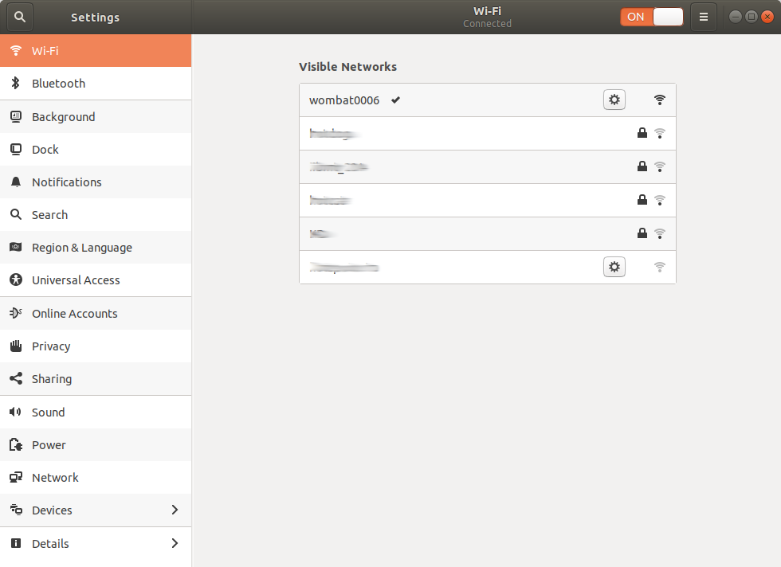
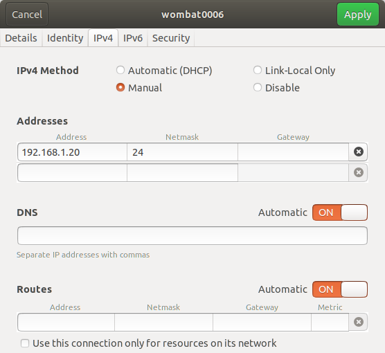
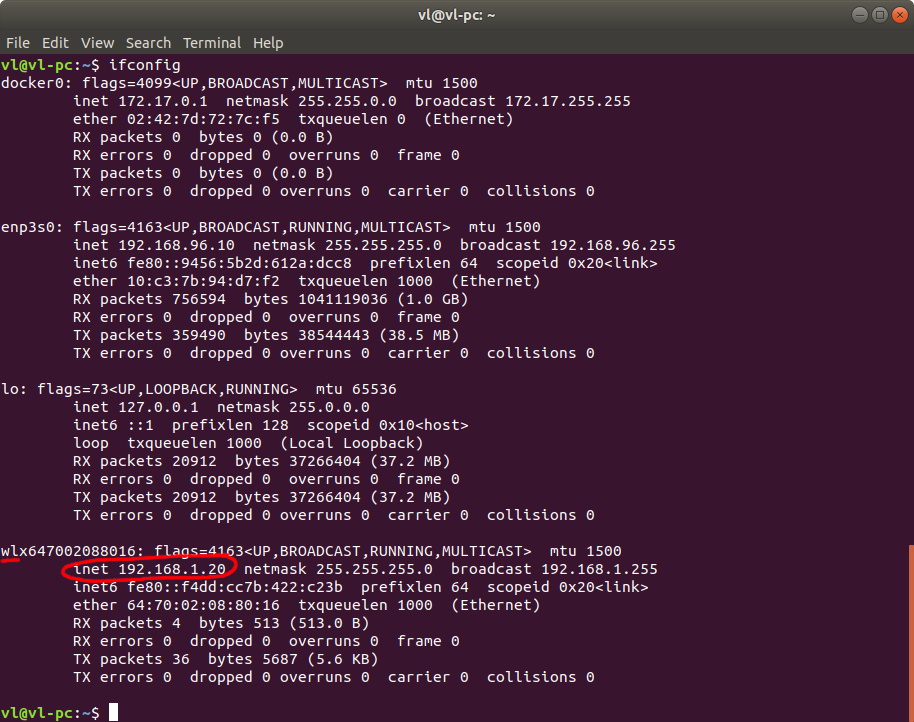
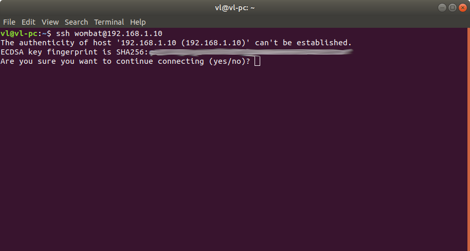
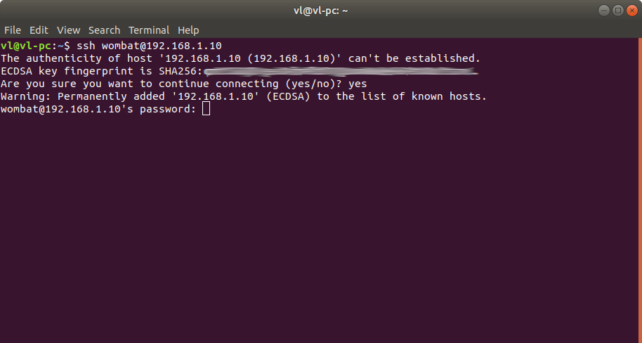
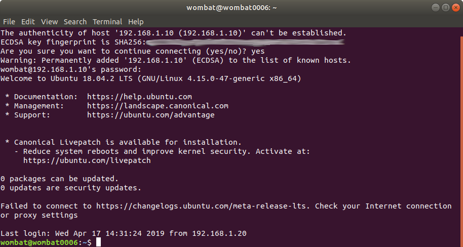
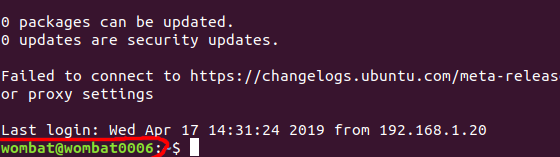
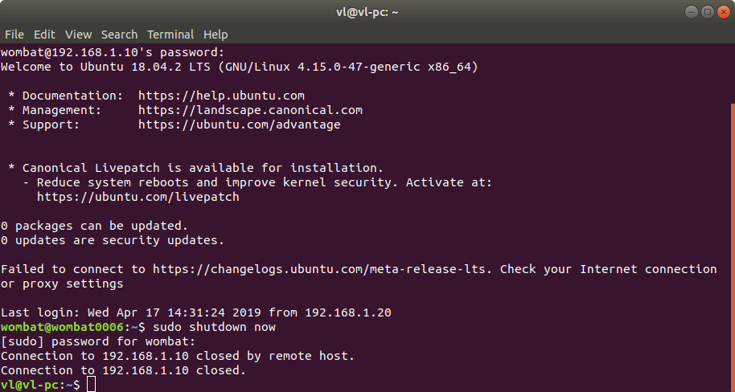

# Подключение к компьютеру робота Вомбат

* [Подключение к бортовому компьютеру](#подключение-к-бортовому-компьютеру)
* [Настройка параметров сети](#настройка-параметров-сети)
* [Подключение по SSH](#подключение-по-ssh)
* [Корректное завершение работы бортового компьютера](#корректное-завершение-работы-бортового-компьютера)

## Подключение к бортовому компьютеру

Не смотря на то, что бортовой компьютер имеет необходимые разъёмы для подключения внешнего монитора и клавиатуры/мыши, настоятельно не рекомендуется использовать периферию, поключённую по проводу. Существует опасность того, что в начале движения подключенные устройства могут опрокинуться. Особенно не практично использование внешнего монитора на открытом воздухе.

Для подключения и выполнения команд на бортовом компьютере рекомендуется использовать беспроводное сетевое соединение:

- ROS позволяет создавать распределённую вычислительную сеть, позволяющую прозрачно для программ выполняться на различных узлах сети и обмениваться данными, будто бы они запущены на одной машине.
- Применение SSH даёт возможность удалённо выполнять команды из командной строки.

Таким образом, чтобы запустить на бортовом компьютере необходимые драйверы оборудования и управляющие ноды, необходимо подключиться к нему по SSH. 

### Настройка параметров сети

Подразумевается, что бортовой компьютер и компьютер оператора находятся в одном сегменте локальной сети.

На роботе развёрнута WIFI точка доступа c именем вида _wombatNNNN_, где NNNN - серийный номер робота. Пароль по умолчанию прилагается в инструкции.

Бортовой компьютер робота настроен на работу в подсети **192.168.1.xxx** и имеет статический IP-адрес **192.168.1.10**. Вы можете изменить эти параметры, исходя из собственных потребностей. В документации далее будут рассматриваться параметры по умолчанию.

В начале работы необходимо создать соединение между точкой доступа бортового компьютера и компьютером оператора. Для этого в настройках беспроводных сетей неоходимо выбрать соответствующую сеть, например _wombat0006_. Бортовой комьютер при этом должен быть включён.

<div style="display:inline-block;">

</div>

Затем необходимо перейти в настройки соединения и во вкладке IPv4 выбрать режим получения IP-адреса на ручной. В качестве IP адреса компьютера можно выбрать любой свободный адрес, например _192.168.1.20_, после чего нажать _применить_.

<div style="display:inline-block;">

</div>

Узнать свой текущий IP-адрес можно с помощью команды 

```bash
ifconfig
```

Вывод должен содержать адрес **192.168.1.20** для беспроводного соединения (количество сетевых интерфейсов на вашем компьютере может отличаться):

<div style="display:inline-block;">

</div>

Если вы видите подобный вывод, значит адрес компьютера оператора настроен верно.

### Подключение по SSH

Для удалённого выполнения команд на бортовом комьютере робота можно подключиться к нему по протоколу _SSH_. Для этого в командной строке необходимо выполнить команду:

```bash
ssh wombat@192.168.1.10
```

где wombat - имя пользователя удалённого компьютера. При первом подключении будет выдано предложение добавить IP-адрес бортового компьютера в список известных хостов. Необходимо ответить _yes_

<div style="display:inline-block;">

</div>

Затем последует приглашение ввода пароля. Пароль по умолчанию прилагается в инструкции.

<div style="display:inline-block;">

</div>

В случае успешного подключения экран будет иметь следующий вид:

<div style="display:inline-block;">

</div>

Теперь все команды, введённые в данном окне терминала, будут выполняться на удалённом компьютере робота. Подсказкой того, на каком компьютере будет выполняться команда, является приглашение ввода операционной системы:



_wombat@wombat0006_ означает: команды будут выполняться на компьютере _wombat0006_ от имени пользователя _wombat_

### Корректное завершение работы бортового компьютера

Необходимо корректно завершать работу бортового ПК. Перед выключением питания следует:

1. Завершить работу всех запущенных нод и программ в открытых терминалах посредством нажатия CTRL+C
2. Программно завершить работу операционной системы бортового компьютера, посредством команды:

|**проверить окно терминала, иначе будет выключен компьютер оператора!**|


```bash
sudo shutdown now
```

<div style="display:inline-block;">

</div>

Питание бортового компьютера можно отключить.
