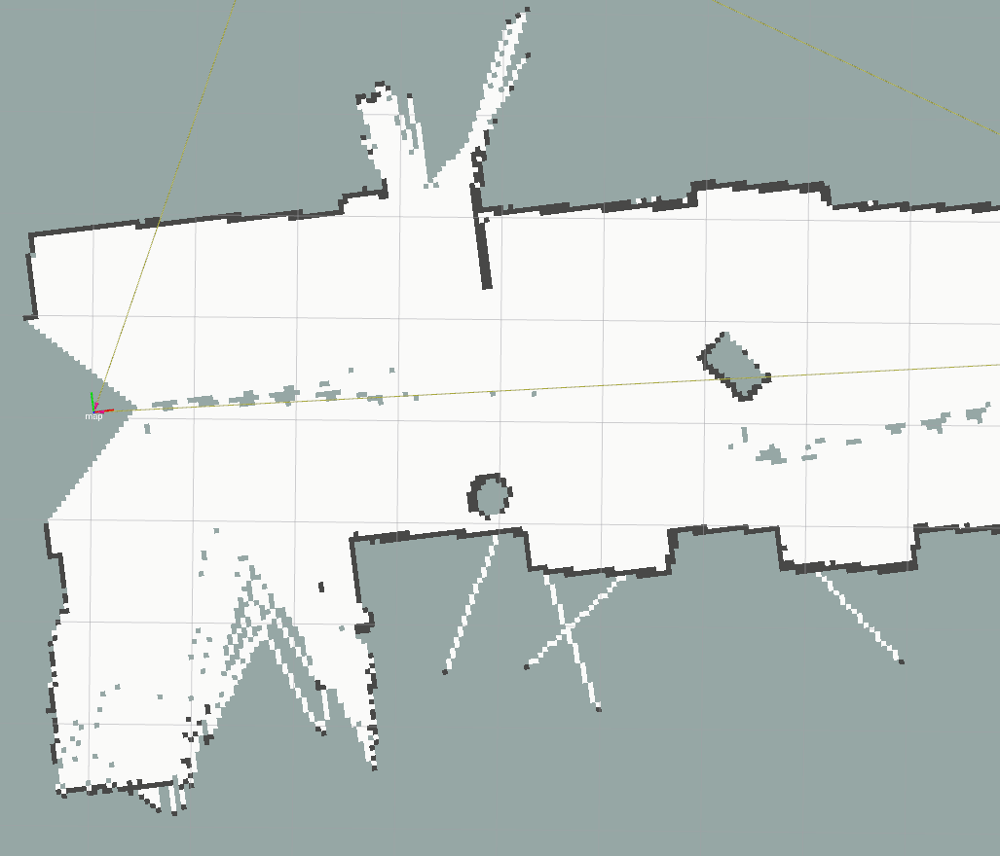
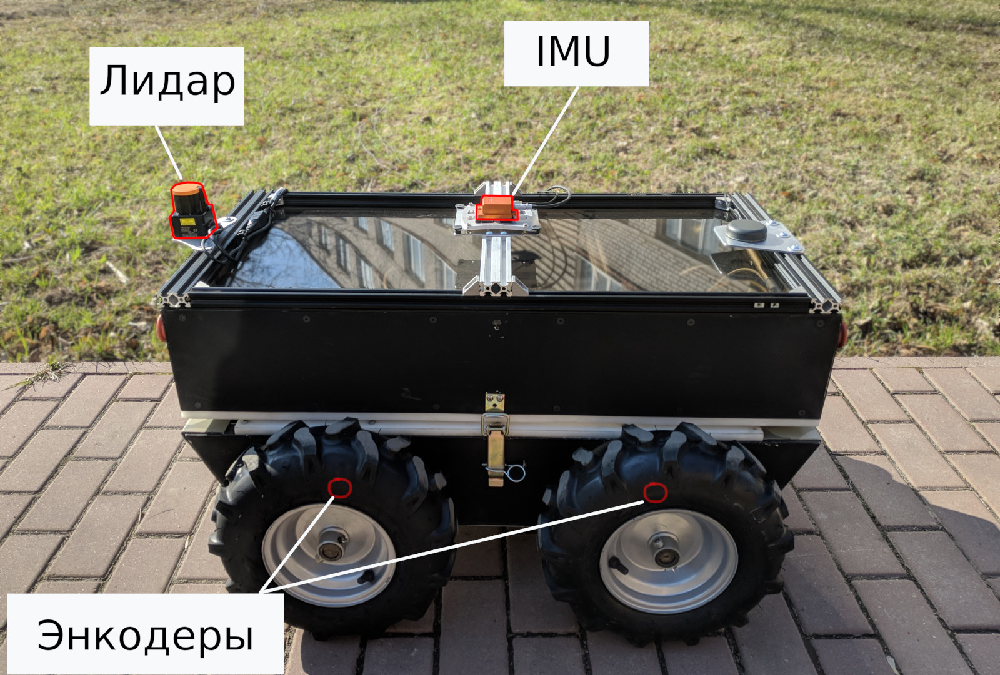
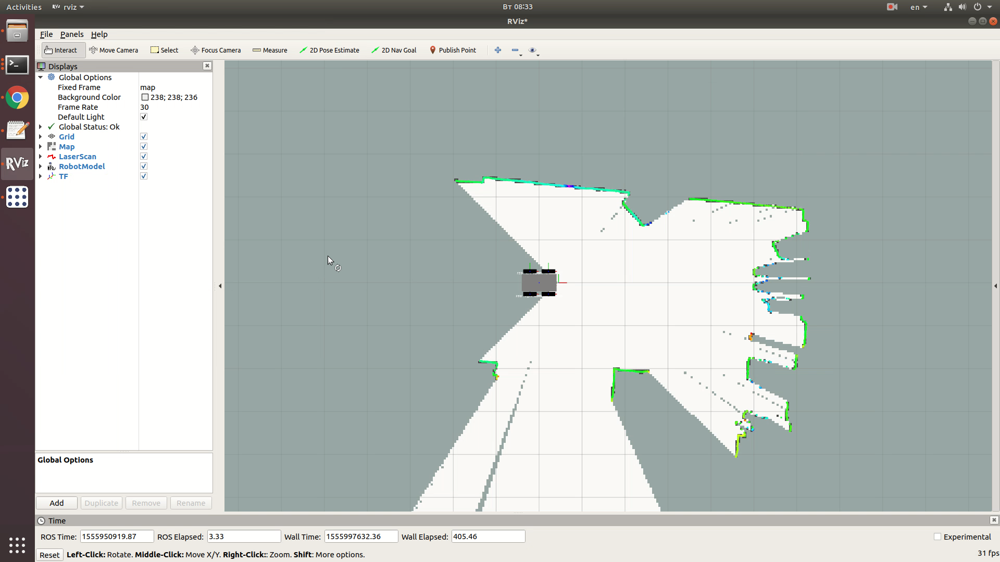
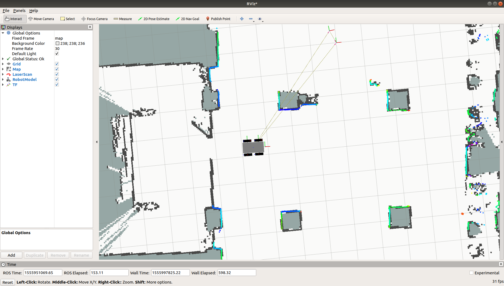
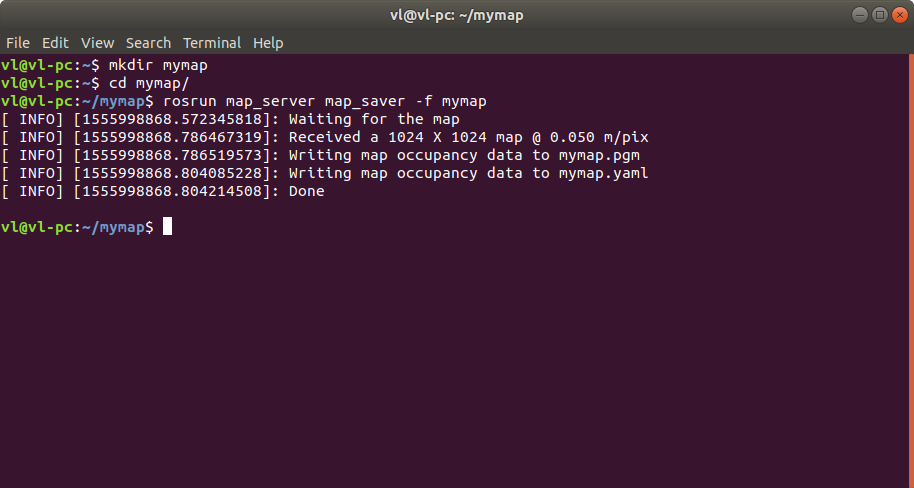
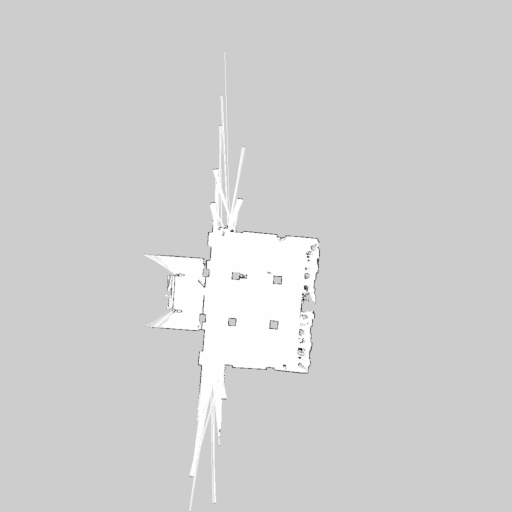

# Построение 2D карты помещения

* [Общие сведения](#общие-сведения)
* [Набор датчиков для построения карты](#требования-к-роботу)
* [Обзор доступных пакетов для построения карты в ROS](#обзор-доступных-пакетов-для-построения-карты-в-ros)
* [Построение карты помещения с помощью hector_slam](#построение-карты-помещения-с-помощью-hector_slam)
* [Сохранение карты](#сохранение-карты)

## Общие сведения
Автономная навигация на заранее известной карте - один из возможных сценариев применения роботов, который представляет большой интерес со стороны исследователей в области робототехники. Для функционирования робота в данном режиме необходимо заранее построить карту той местности, где предполагается навигация.

В случае, когда робот двигается только по ровной плоской поверхности, например при движении внутри помещений, то представление карты можно значительно упростить, рассматривая только план местности. При этом карта представляется в виде растрового 8-битного изображения, каждая точка которого кодирует наличие препятствия в соответствующей области на карте: 0 - свободно, 100 - занятно, -1 - неизвестно:



Карта всей местности называется "глобальной" картой. Для сохранения и загрузки глобальной карты в ROS существует пакет [map_server](http://wiki.ros.org/map_server), являющийся частью стека [ROS navigation](http://wiki.ros.org/navigation).

Глобальная карта используется для локализации - определения положения робота на ней. Также глобальная карта применяется для построения глобальной траектории при автономной навигации.

### Требования к роботу

Минимальный набор датчиков, необходимый для построения карты:
- Колёсные энкодеры(одометры) для оценки пройдённого пути. Необходимы для подсказки алгоритму SLAM приращения координат.
- Датчик расстояния до препятствий. Чем выше разрешение датчика, тем более детальной может быть построена карта. Большинство доступных пакетов ROS для построения карты поддерживают лидары.
- IMU(или БИНС) опционально может использоваться в качестве дополнительного источника информации для уточнения данных одометрии и компенсации угла наклона робота при движении по неровной поверхности.



Комплект для 2D навигации робота Вомбат содержит все необходимые датчики для построения двухмерной карты.

## Обзор доступных пакетов для построения карты в ROS

Для построения 2D карты в ROS существует несколько пакетов:

- [gmapping](http://wiki.ros.org/gmapping) - OpenSlam's Gmapping
- [hector_slam](http://wiki.ros.org/hector_slam) - Hector SLAM
- [ohm_tsd_slam](http://wiki.ros.org/ohm_tsd_slam) - ohm_tsd_slam

Данные пакеты используют лидары в качестве основного датчика положения препятствий. Робот Вомбат полностью совместим с каждым из пакетов для построения карты.

## Построение карты помещения с помощью hector_slam

Рассмотрим процесс построения карты с помощью робота Вомбат.

Предполагается, что робот будет осуществлять движение на плоской поверхности в окружении стен и достаточного количества препятствий. Типичной средой для этого является помещение, лаборатория или коридор здания. Следует учитывать, что резкие изменения угла наклона робота относительно плоскости земли, вызванные наездом на высокие пороги или препятствия, могут ухудшить результат работы алгоритма построения карты.

После запуска процесса построения карты необходимо управлять роботом в режиме телеуправления(с помощью пульта ДУ), "проведя" его по исследуемой территории. В процессе движения алгоритм построения карты будет объединять показания датчиков и инкрементально "достраивать" карту. Когда карта требуемого пространства будет построена, её можно сохранить на диск для дальнейшего использования в задаче навигации по известной карте.

Процесс запуска нод построения карты с помощью _hector_slam_ следующий:

Для бортового компьютера:

1. В окне терминала выполнить команду:
```bash
roscore
```

2. В другом окне терминала выполнить команду:
```bash
roslaunch wombat_navigation hector_mapping.launch
```

Для компьютера оператора:

```bash
export ROS_MASTER_URI=http://192.168.1.10:11311

rviz
```

Окно утилиты rviz будет иметь следующий вид:



После этого, с помощью пульта ДУ осуществите перемещение робота по исследуемой местости, чтобы требуемые участки помещения попали на карту.



### Сохранение карты

Когда карта построена, её можно сохранить для дальнейшего использования с помощью утилиты [map_saver](http://wiki.ros.org/map_server#map_saver). Для этого в новом окне терминала(на бортовом компьютере) необходимо выполнить:

```bash
mkdir mymap
cd mymap/
rosrun map_server map_saver -f mymap
```
C помощью команды _mkdir_ мы создаём новый каталог mymap, а команда _cd_ осуществляет переход в него.

При успешном выполнении, карта будет сохранена в каталоге mymap в виде набора файлов _mymap.pgm_ и _mymap.yaml_



Файл с расширением yaml содержит служебную информацию о карте.

```
image: mymap.pgm
resolution: 0.050000
origin: [-25.624998, -25.624998, 0.000000]
negate: 0
occupied_thresh: 0.65
free_thresh: 0.196
```

Файл pgm представляет собой растровое изображение. При необходимости можно отредактировать его в графическом редакторе(например, GIMP), например, чтобы убрать артефакты от движущихся объектов.



