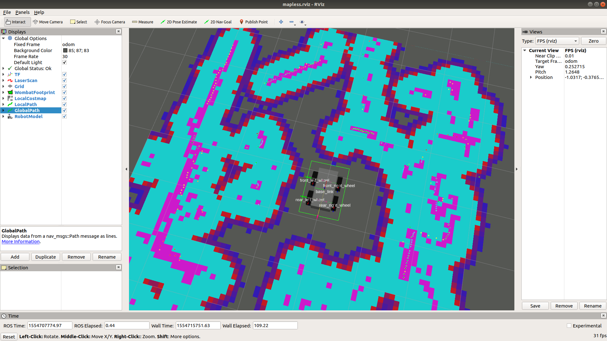
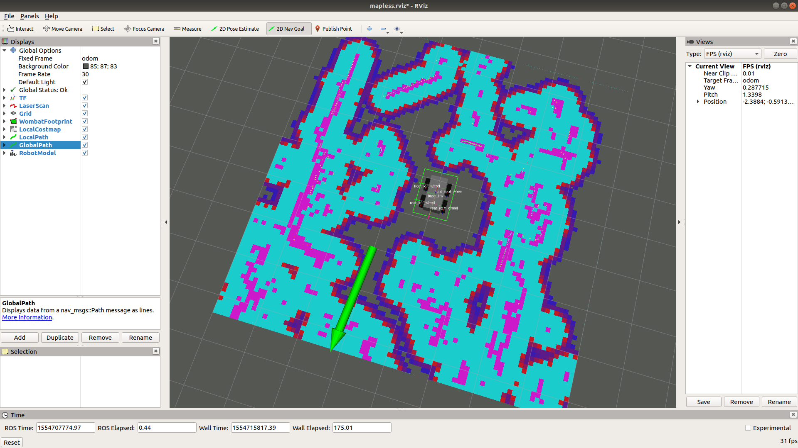
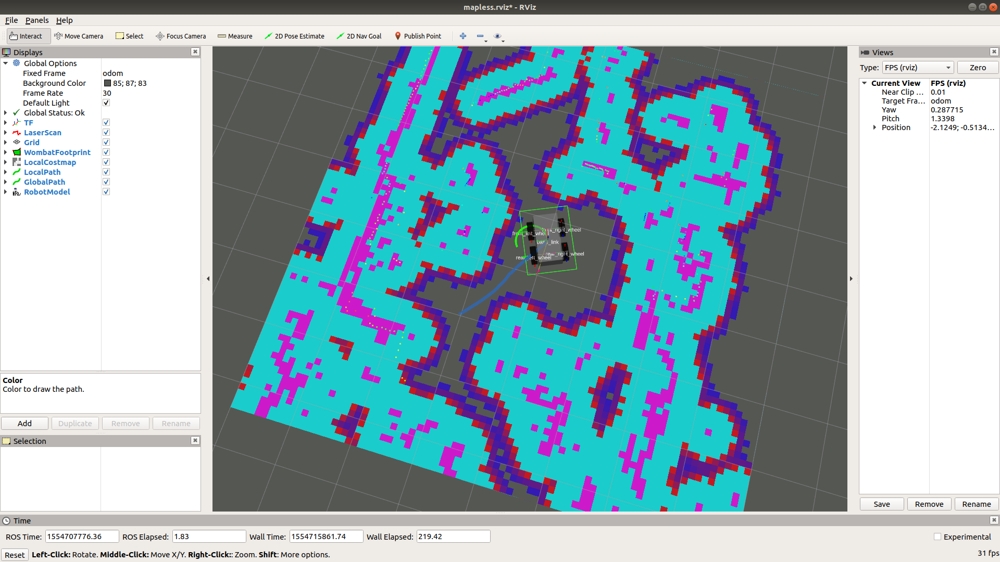

# Движение в заданную точку

Автономное движение робота в заданную точку пространства &mdash; это одна из наиболее популярных задач в  робототехнике. Она включает в себя такие подзадачи как обработка сенсорных данных, оценка собственного положения на карте, поиск препятствий, планирование траектории и управление движением. Сложность разрабатываемой системы при этом сильно зависит от предъявляемых к роботу требований. В простейшем случае роботу необходимо добраться до точки с заданными координатами, объезжая препятствия на своем пути. В данном случае робот не обладает некоторой предварительно загруженной картой и не строит ее в процессе своего движения. Таким образом, он "видит" окружающий мир только в радиусе действия используемых датчиков.

# Навигация без глобальной карты

В том случае, когда глобальная карта заранее не известна, можно запустить сценарий следования в несколько ограниченном режиме. При этом планирование траектории будет осуществляться только на основе локальной карты проходимости. Данный сценарий пригоден для быстрого старта, так как содержит минимальное количество нод, которое должно быть настроено и запущено.

В пакете wombat_navigation в подкаталоге launch содержатся примеры launch-файлов, необходимые для запуска различных сценариев навигации робота с использованием пакетов из ROS navigation stack.
 
Для движения по контрольным точкам без глобальной карты, в пакете wombat_navigation имеется [launch-файл](http://wiki.ros.org/roslaunch) _move_base_without_static_map.launch_

Чтобы робот Вомбат автономно двигался в заданную точку, необходимо выполнить следующие действия:
1. Открыть терминал Ubuntu (для этого можно воспользоваться сочетанием клавиш Ctrl+Alt+T) и выполнить команду:
```bash
roscore
```

2. Открыть другое окно терминала (либо вкладку) и выполнить команду:
```bash
roslaunch wombat_navigation move_base_without_static_map.launch
```

В случае, если все системы работают исправно, откроется окно утилиты rviz с изображением текущей карты проходимости.

<div style="display:inline-block;">

</div>

Для задания цели выберите инструмент 2D Nav Goal и укажите им позицию на карте, куда роботу требуется переместиться:
<div style="display:inline-block">

</div>

Если целевая позиция находится в зоне досягаемости и планировщику траектории удалось построить маршрут, робот начнёт автономное движение к цели.

Экран rviz будет иметь следующий вид:

<div style="display:inline-block">

</div>
